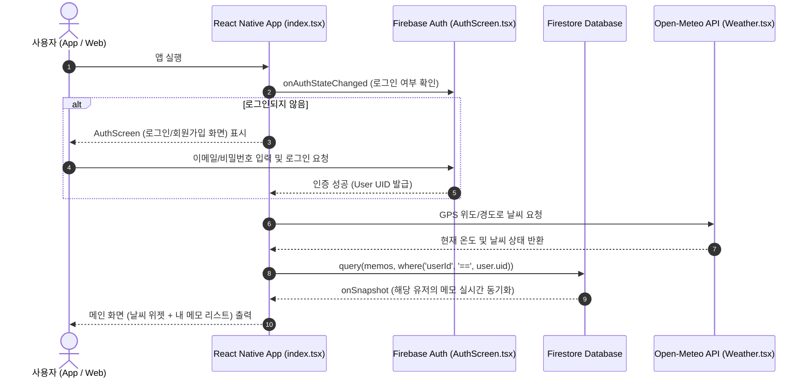

# 📘 Weather Todo App - 코드 워크플로우 & 아키텍처 가이드

이 문서에는 **Weather Todo** 앱의 전체 데이터 흐름, 각 파일별 작성 이유, 그리고 **다른 사람에게 이 코드를 명쾌하게 설명하는 방법**이 정리되어 있습니다.

---

## 1. 🔄 한눈에 보는 전체 앱 워크플로우

---

## 2. 🧩 핵심 파일별 작성 이유와 설계 의도

### 1) `firebaseConfig.js` - 클라우드 통로 세팅
* **역할**: 구글 클라우드(Firestore)와 인증(Auth) 서비스에 접속하는 전역 통로를 초기화합니다.
* **왜 이렇게 작성했는가?**: 
  - `app.json`의 `extra.firebase` 설정값을 `expo-constants` 모듈로 읽어오도록 설계했습니다.
  - **이유**: 로컬 개발(`npm run web`), 안드로이드 직접 설치(`APK`), 플레이 스토어 배포(`.aab`) 등 **어떤 빌드 환경에서도 `.env` 파일 누락 문제 없이 100% 동일하게 호환**되도록 만들기 위해서입니다.

---

### 2) `src/app/index.tsx` - 메인 관제탑 (State Controller)
* **역할**: 전체 앱의 상태(인증 상태, 메모 데이터, 로딩 상태)를 총괄 관리하는 메인 화면입니다.
* **왜 이렇게 작성했는가?**:
  1. **로그인 상태 분기**: `onAuthStateChanged` 리스너를 통해 유저가 로그인하지 않았으면 `<AuthScreen />`을 띄우고, 로그인했으면 메모장 화면을 띄웁니다.
  2. **유저 데이터 격리**: `where('userId', '==', user.uid)` 조건절을 붙여 내 메모만 구글 서버에서 가져옵니다. 다른 사람의 메모와 섞이지 않는 보안성을 확보했습니다.
  3. **실시간 동기화 (`onSnapshot`)**: 새로고침 버튼 없이도 데이터가 추가/삭제되면 0초 만에 화면이 갱신됩니다.

---

### 3) `src/components/AuthScreen.tsx` - 인증 전문 컴포넌트
* **역할**: 이메일/비밀번호 기반 회원가입과 로그인을 처리합니다.
* **왜 이렇게 작성했는가?**:
  - `isSignUp` 이라는 단순한 토글 상태 하나로 **회원가입 폼과 로그인 폼을 동적으로 전환**하여 코드 중복을 최소화했습니다.
  - 구글 서버에서 돌아오는 영어 에러 코드(`auth/invalid-email`, `auth/wrong-password` 등)를 사용자가 이해하기 쉬운 친절한 메시지로 가공해 줍니다.

---

### 4) `src/components/Weather.tsx` - 위치 기반 날씨 위젯
* **역할**: 스마트폰 GPS로 내 위치를 파악하고 무료 Open-Meteo API로 날씨를 불러옵니다.
* **왜 이렇게 작성했는가?**:
  - **GPS ➡️ 역지오코딩 ➡️ API 호출**: 위도/경도를 구한 뒤 도시 이름(City)으로 변환해 줍니다.
  - **섭씨(℃) ↔ 화씨(℉) 토글**: 온도를 단위 변환할 때 매번 서버에서 데이터를 다시 요청하지 않고, **프론트엔드 연산(`(C * 1.8) + 32`)으로 실시간 계산**하여 0ms 반사 속도를 내도록 설계했습니다.

---

## 3. 🎙️ 이 코드를 남에게 멋지게 설명하는 3가지 핵심 포인트 (Presentation Pitch)

누군가 *"이 앱 어떻게 만들었어?"* 라고 물어보면 아래 3가지 포인트를 강조해 보세요!

### 1️⃣ "서버리스(BaaS) 아키텍처로 백엔드 없이 실시간 데이터베이스를 구축했습니다."
> *"백엔드 서버를 직접 띄우지 않고 구글 Firebase(Firestore)를 활용했습니다. `onSnapshot` 이라는 웹소켓 기반 실시간 구독 모델을 사용해서, 메모를 쓰면 다른 기기나 웹 브라우저에서도 새로고침 없이 즉시 갱신됩니다."*

### 2️⃣ "유저 UID 기반 멀티테넌시(Multi-tenancy)로 데이터 보안을 지켰습니다."
> *"모든 메모 데이터가 저장될 때 작성자의 고유 식별자(`userId: user.uid`) 꼬리표가 함께 들어갑니다. 조회할 때 `where` 조건절로 내 아이디와 일치하는 데이터만 쿼리해 오기 때문에 로그인한 사람만 자기 메모를 볼 수 있도록 데이터가 완전 격리되어 있습니다."*

### 3️⃣ "Cross-Platform 최적화 및 0ms 사용자 경험(UX) 연산을 적용했습니다."
> *"React Native와 Expo Router를 기반으로 작성되어 안드로이드, iOS, Web 브라우저까지 하나의 코드베이스로 작동합니다. 특히 섭씨/화씨 온도를 전환할 때는 서버 네트워크 요청 없이 즉시 프론트엔드 단에서 변환 계산되어 사용자에게 쾌적한 UX를 제공합니다."*
