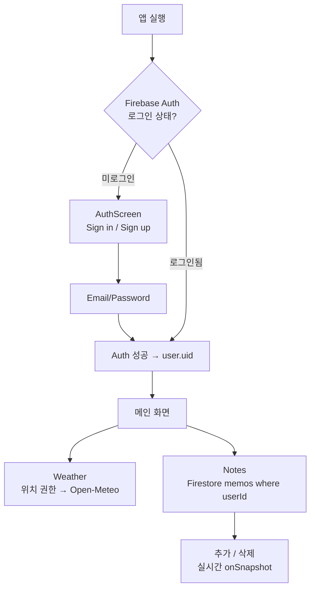
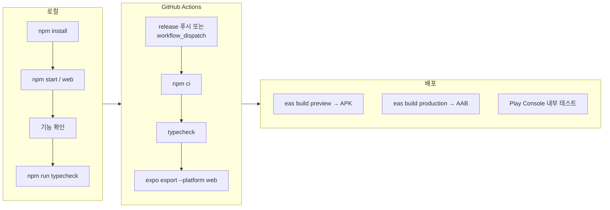

# Weather Todo

위치 기반 날씨 + Firebase 개인 메모 앱입니다.

---

## 기술 스택

| 영역 | 기술 | 역할 |
|------|------|------|
| UI / 앱 | **Expo 57**, **React Native 0.86**, **React 19** | 크로스 플랫폼 (Web / Android / iOS) |
| 라우팅 | **Expo Router** | 파일 기반 네비게이션 (`src/app`) |
| 언어 | **TypeScript** | 정적 타입 검사 (`tsc --noEmit`) |
| 인증 | **Firebase Authentication** | 이메일/비밀번호 로그인·회원가입 |
| 데이터베이스 | **Cloud Firestore** | 유저별 메모 실시간 동기화 (`onSnapshot`) |
| 설정 | **expo-constants** + `app.json` | Firebase 클라이언트 설정 (`.env` 없음) |
| 위치 | **expo-location** | GPS 권한·좌표·역지오코딩 |
| 날씨 API | **Open-Meteo** | 무료 현재 날씨 (API 키 불필요) |
| 아이콘 | **@expo/vector-icons** (Feather) | UI 아이콘 |
| CI | **GitHub Actions** | `release`/수동: typecheck·web export + Android AAB 아티팩트 |
| 네이티브 빌드 | **EAS Build** | APK / AAB 생성 |

### 주요 의존성 버전 (요약)

- `expo` ~57 · `expo-router` ~57 · `expo-location` ~57
- `firebase` ^12 · `typescript` ~6 · `react-native` 0.86

---

## 앱 워크플로우



### 데이터 흐름

1. **인증** — `onAuthStateChanged`로 세션 감지 → 없으면 `AuthScreen`, 있으면 메인
2. **날씨** — 위치 허용 → 위경도 → Open-Meteo `current_weather` → ℃/℉ 표시  
   (웹은 브라우저 위치 허용 + **Allow location** 버튼 클릭 필요)
3. **메모** — `memos` 컬렉션에 `{ text, userId, createdAt }` 저장 · 본인 `uid`만 조회

### Firestore 규칙 (요지)

- 로그인 사용자만 접근
- `userId == request.auth.uid`인 문서만 읽기/쓰기/생성

---

## 개발 → CI → 배포 워크플로우



| 단계 | 무엇을 하나 | 명령 / 위치 |
|------|-------------|-------------|
| 1. 설정 | Firebase 프로젝트 + `app.json` | 아래 [Firebase 설정](#firebase-설정) |
| 2. 개발 | Expo 개발 서버 | `npm start` / `npm run web` |
| 3. 검증 | 타입 검사 · 웹 번들 | `npm run typecheck` · `npm run export:web` |
| 4. CI | `release`/수동 → typecheck·export | `.github/workflows/ci.yml` |
| 5. Android 빌드 | `release`/수동 → `.aab` 아티팩트 | `.github/workflows/build-android.yml` (`EXPO_TOKEN` 필요) |
| 6. 빌드 (로컬 EAS) | 설치 파일 | `eas build -p android --profile preview\|production` |
| 7. 스토어 | Play 내부 테스트 | `com.abraham.weathertodo` |

---

## Firebase 설정

1. [Firebase Console](https://console.firebase.google.com/)에서 프로젝트 생성
2. **+ Add app → Web**으로 웹 앱 등록 → config 값 복사
3. **Authentication** → Get started → **Sign-in method** → **Email/Password** Enable
4. **Firestore** 생성 후 Rules:

```
rules_version = '2';
service cloud.firestore {
  match /databases/{database}/documents {
    match /memos/{memoId} {
      allow read, write: if request.auth != null
        && request.auth.uid == resource.data.userId;
      allow create: if request.auth != null
        && request.auth.uid == request.resource.data.userId;
    }
  }
}
```

5. config를 `app.json` → `expo.extra.firebase`에 넣기 (**`.env` 사용 안 함**)

```json
"extra": {
  "firebase": {
    "apiKey": "...",
    "authDomain": "...",
    "projectId": "...",
    "storageBucket": "...",
    "messagingSenderId": "...",
    "appId": "...",
    "measurementId": "..."
  }
}
```

`firebaseConfig.js`가 `expo-constants`로 위 값을 읽어 Auth / Firestore를 초기화합니다.

---

## 로컬 실행

```bash
npm install
npm start          # Expo 개발 서버 (w / a / i 로 플랫폼 선택)
npm run web        # 브라우저
npm run android    # Android
npm run ios        # iOS (macOS)
```

### npm 스크립트

| 명령 | 설명 |
|------|------|
| `npm start` | Expo 개발 서버 |
| `npm run web` / `android` / `ios` | 플랫폼별 실행 |
| `npm run typecheck` | TypeScript (`tsc --noEmit`) |
| `npm run export:web` | 웹 정적 번들 (CI와 동일) |
| `npm run lint` | Expo lint |

웹에서 날씨가 안 나오면: 주소창 ⓘ → Location **Allow** → 패널의 **Allow location** 클릭.

---

## CI (GitHub Actions)

LingoFlow와 같이 **`main` 매 커밋에는 돌지 않습니다.**  
트리거: **`workflow_dispatch`(수동)** 또는 **`release` 브랜치 push**

| 워크플로 | 파일 | 결과 |
|----------|------|------|
| **CI** | `.github/workflows/ci.yml` | typecheck + web export (아티팩트 없음) |
| **Build Android** | `.github/workflows/build-android.yml` | Play용 **`.aab`** → Actions Artifacts |

### Android AAB 받는 방법

1. GitHub repo → **Settings → Secrets and variables → Actions**  
   - `EXPO_TOKEN` 추가 ([expo.dev](https://expo.dev) → Access Token)
2. **Actions** → **Build Android (EAS Local)** → **Run workflow**
3. 성공 후 해당 run 상단 **Artifacts**에서 `weather-todo-Android-AAB` 다운로드  
   (보관 7일)

로컬에서 타입/웹만 확인:

```bash
npm run typecheck && npm run export:web
```

---

## EAS 빌드 & Play Store

```bash
npm install -g eas-cli
eas login

eas build -p android --profile preview      # APK (직접 설치)
eas build -p android --profile production  # AAB (스토어)
```

| 항목 | 값 |
|------|-----|
| Package name | `com.abraham.weathertodo` |
| EAS projectId | `app.json` → `extra.eas.projectId` |

**Play 제출 요약:** 개발자 계정 → production AAB 업로드 → Internal testing → 테스터 이메일 추가(Enter로 확정) → 초대 링크에서 Become a tester → Play Store 설치

---

## 프로젝트 구조

```text
weather-todo/
├── app.json                      # 앱 메타 + Firebase (extra.firebase) + EAS
├── firebaseConfig.js             # Firebase Auth / Firestore 초기화
├── eas.json                      # preview(APK) / production(AAB)
├── .github/workflows/
│   ├── ci.yml                    # release/수동: typecheck + web export
│   └── build-android.yml         # release/수동: AAB → Artifacts
├── package.json
├── src/
│   ├── app/
│   │   ├── _layout.tsx           # Root Stack
│   │   └── index.tsx             # Auth 분기 · 메모 CRUD
│   ├── components/
│   │   ├── AuthScreen.tsx        # 로그인 / 회원가입
│   │   └── Weather.tsx           # 위치 · 날씨 · ℃/℉
│   └── constants/
│       └── colors.ts             # UI 팔레트
└── README.md
```

---

## 기능 요약

- 이메일 로그인/회원가입 (유저별 메모 격리)
- 현재 위치 날씨 + ℃ / ℉ 토글
- Firestore 실시간 메모 추가·삭제
